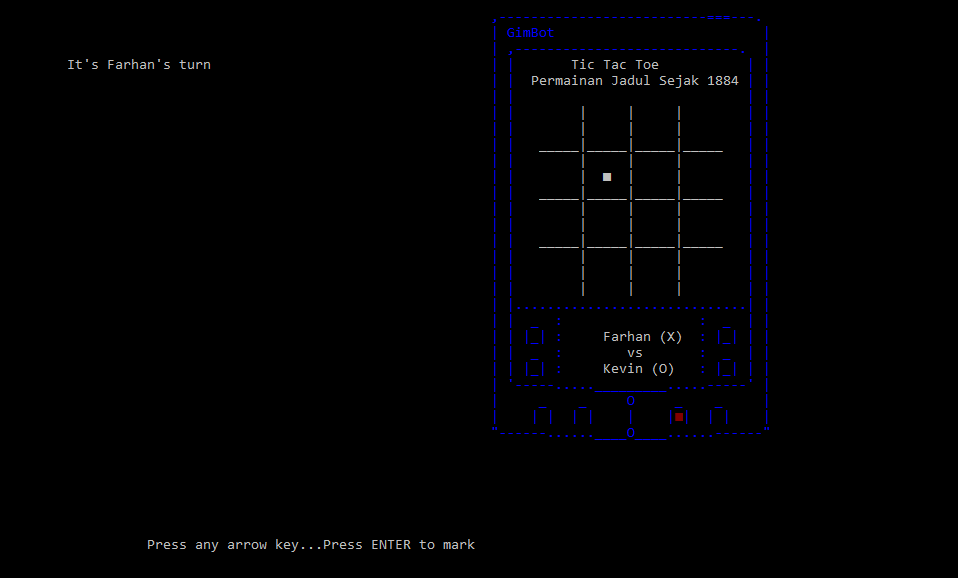

# Kelompok 5
Proyek mini Tic Tac Toe oleh Kevin Darmawan (1806148744) dan Farhan Almasyhur (1806200375). Pada proyek ini kami menggunakan array2d, file processing, dan sound processing.

## main function
function main ini berfungsi untuk membuat layar menjadi fullscreen dan memulai game dengan splashscreen
```bash
 	fullscreen();	//mengubah windows ke full screen
	hidecursor();	//menghilangkan cursor
	splashscreen(); //memulai game dengan splash screen
```

### board()
memunculkan layout dari tictactoe 4x4

```bash
int board(char player1[10], char player2[10]){
	
	gotoxy(98,10); printf("Tic Tac Toe");
	gotoxy(93,11); printf("Permainan Jadul Sejak 1884");
	gotoxy(102,27); printf("%s (X)", player1);
	gotoxy(105, 28); printf("vs");
	gotoxy(102,29); printf("%s (O)", player2);
	
	//Papan terdiri atas array multidimensi dengan tipe data char 
	//ketika awal permainan, tiap array NULL

	gotoxy(94,13); printf("     |     |     |     \n");
 	gotoxy(94,14); printf("  %c  |  %c  |  %c  |  %c \n", square[0][0], square[0][1], square[0][2], square[0][3]);
  	gotoxy(94,15); printf("_____|_____|_____|_____\n");
  	gotoxy(94,16); printf("     |     |     |     \n");
    	gotoxy(94,17); printf("  %c  |  %c  |  %c  |  %c \n", square[1][0], square[1][1], square[1][2], square[1][3]);
    	gotoxy(94,18); printf("_____|_____|_____|_____\n");
 	gotoxy(94,19); printf("     |     |     |     \n");
	gotoxy(94,20); printf("  %c  |  %c  |  %c  |  %c \n", square[2][0], square[2][1], square[2][2], square[2][3]);
	gotoxy(94,21); printf("_____|_____|_____|_____\n");
  	gotoxy(94,22); printf("     |     |     |     \n");
   	gotoxy(94,23); printf("  %c  |  %c  |  %c  |  %c \n", square[3][0], square[3][1], square[3][2], square[3][3]);
   	gotoxy(94,24); printf("     |     |     |     \n\n");    
    //tombol warna warni
    	gotoxy(94,32);
	    printf(YELLOW "%c"RESET, press[0]);
	    gotoxy(99,32);
	    printf(GREEN "%c"RESET, press[1]);
	    gotoxy(111,32);
	    printf(RED "%c"RESET, press[2]);
	    gotoxy(116,32);
	    printf(CYAN "%c"RESET, press[3]);
}
```

### arrow()
mengarahkan tempat dimana pemain akan mengisi X atau O
```bash
 int chr1, chr2, player = 1, a;
 char mark;
 
 printf("It's %s's turn\n\n", player1);
 printf("Press any arrow key...\n");
 chr1 = getch();
 
 if (chr1 == 0xE0) //to check scroll key interrupt
 	{				
	while(TRUE){ 
 		 chr2 = getch();  //to read arrow key
 		 if(chr2 == ESCAPE) break;
 	 switch(chr2)
 	 {
 	    case UP_ARROW: i--; 
 	   	 if(i<0) i == 0; printf("\r%c", square[i][j]);
	       break;
	    case DOWN_ARROW: i++; 
	   	  if(i>2) i == 2; printf("\r%c", square[i][j]);
	       break;
	    case LEFT_ARROW: j--; 
	   	  if(j<0) j == 0; printf("\r%c", square[i][j]);
 	       break;
 	    case RIGHT_ARROW: j++;
 	  	  if(j>2) j == 2;  printf("\r%c", square[i][j]);
	        break;
	    case ENTER:
	    	if(square[i][j] == 'X'||square[i][j] == 'O'){
	    		printf("  -> invalid move");
	    		player--;
			}
	    	else{
				mark = (player % 2 == 1) ? 'X' : 'O'; 
				square[i][j] = mark;
				board(player1, player2);
				if(player % 2 ==1) printf("\rIt's %s's turn                       \n\n", player1); 
				else printf("\rIt's %s's turn                   \n\n", player2); 
				printf("\n");
			}
			player++;
			break;
 		 }
		}
	 };
}
```

## checkwin.h
menentukan apakah player 1 atau player 2 yang memenangkan permainan. Ketika permainan berakhir akan menampilan player yang menang

Code dari checkwin yaitu
```bash
void checkwin(char square[3][3],char player1[10],char player2[10]){
	if(square[0][0]==square[0][1] && square[0][1] == square[0][2] && square[0][0] != NULL){
		if(square[0][0]=='X'){
			Sleep(1000);
			system("cls");
			win1(player1);
		}
		else{
			Sleep(3000);
			system("cls");
			win2(player2);
		}
	}
	else if(square[0][1]==square[0][2]&&square[0][2] == square[0][3] && square[0][1] != NULL){
		if(square[0][1]=='X'){
			Sleep(1000);
			system("cls");
			win1(player1);
		}
		else{
			Sleep(1000);
			system("cls");
			win2(player2);
		}
	}
	else if(square[1][0]==square[1][1]&&square[1][1] == square[1][2] && square[1][0] != NULL){
		if(square[1][0]=='X'){
			Sleep(1000);
			system("cls");
			win1(player1);
		}
		else{
			Sleep(1000);
			system("cls");
			win2(player2);
		}
	}
```

## File and Sound Processing
### Sound Processing (pada header Beep.h)
Pada proyek ini, digunakan sound processing ketika splahscreen, dan jika salah satu pemain menang, code yang digunakan yaitu :
```bash
#define BEEP Beep(500,85);
#define CHOOSE Beep(1000,85);

#define C4 Beep(262,220);
#define Ces4 Beep(277,220);
#define D4 Beep(293,220);
#define Des4 Beep(311,220);
#define E4 Beep(330,100);
#define F4 Beep(350,100);
#define Fes4 Beep(370,220);
#define G4 Beep(391,220);
#define Ges4 Beep(415,220);
#define A4 Beep(440,100);
#define Aes4 Beep(466,220);
#define B4 Beep(494,220);

#define C5 Beep(523,220);
#define Ces5 Beep(554,220);
#define D5 Beep(587,220);
#define Des5 Beep(622,220);
#define E5 Beep(659,220);
#define F5 Beep(698,220);
#define Fes5 Beep(740,220);
#define G5 Beep(784,220);
#define Ges5 Beep(831,220);
#define A5 Beep(880,220);
#define Aes5 Beep(932,220);
#define B5 Beep(988,220);

#define C6 Beep(1046, 200);
#define C7 Beep(2093,200);

#define ONE Sleep(880);
#define HALF Sleep(480);
#define FORTH Sleep(220);

void winSong(){
	C4 D4 E4 G4 Beep(494, 480); FORTH Beep(391, 480); Beep(523, 700);
}

void splashSong(){
	C4 FORTH Beep(350,600); F4 F4 HALF G4 FORTH Beep(440, 500); A4 A4 HALF
	Beep(440, 500); FORTH Beep(391, 500); F4 G4 Beep(440, 400); Beep(391, 400); F4
}
```
### File Processing (Pada file splash.h)
File processing digunakan untuk membuat animasi pada saat splashscreen
```bash
#define BEEP Beep(500,85);

void splashscreen(){
	int i, a=0;
	char *filename;
    char str[MAXCHAR];
    FILE *fp;
    
    /*Splash screen ini menampilkan animasi permainan tictactoe
	Metode yang digunakan adalah menggunakan file pointer txt dan menimpa file sehingga
	terlihat seperti animasi stop motion*/
    
	    fp=fopen("1.txt", "r");
	    if (fp == NULL){
	        printf("Could not open file");
	        return 1;
	    }
	    BEEP
	    while (fgets(str, MAXCHAR, fp) != NULL)
	        printf("%s", str);
	
	    Sleep(600);
		
		
		gotoxy(0,0);
	    fp=fopen("2.txt","r");
	    if (fp == NULL){
	        printf("Could not open file");
	        return 1;
	    }
	    BEEP
	    while (fgets(str, MAXCHAR, fp) != NULL)
	        printf("%s", str);
	
	    Sleep(600);
		
		
		gotoxy(0,0);
	    fp=fopen("3.txt","r");
	    if (fp == NULL){
	        printf("Could not open file");
	        return 1;
	    }
	    BEEP
	    while (fgets(str, MAXCHAR, fp) != NULL)
	        printf("%s", str);
	
	    Sleep(600);

		
		gotoxy(0,0);
		fp=fopen("4.txt","r");
	    if (fp == NULL){
	        printf("Could not open file");
	        return 1;
	    }
	    BEEP
	    while (fgets(str, MAXCHAR, fp) != NULL)
	        printf("%s", str);
	
	    Sleep(600);
		
		
		gotoxy(0,0);
		fp=fopen("5.txt","r");
	    if (fp == NULL){
	        printf("Could not open file");
	        return 1;
	    }
	    BEEP
	    while (fgets(str, MAXCHAR, fp) != NULL)
	        printf("%s", str);
	
	    Sleep(600);


		gotoxy(0,0);
		fp=fopen("6.txt","r");
	    if (fp == NULL){
	        printf("Could not open file");
	        return 1;
	    }
	    BEEP
	    while (fgets(str, MAXCHAR, fp) != NULL)
	        printf("%s", str);
	
	    Sleep(600);


		gotoxy(0,0);
		fp=fopen("7.txt","r");
	    if (fp == NULL){
	        printf("Could not open file");
	        return 1;
	    }
	    BEEP
	    while (fgets(str, MAXCHAR, fp) != NULL)
	        printf("%s", str);
	
	    sleep(1);
		system("cls");
		
		fp=fopen("8.txt","r");
	    if (fp == NULL){
	        printf("Could not open file");
	        return 1;
	    }
	    while (fgets(str, MAXCHAR, fp) != NULL)
	        printf(YELLOW"%s"RESET, str);
	    gotoxy(82, 24);
	    printf("KEVIN & FARHAN PRODUCTION");
	    
	    //mengecek jika ada interrupt keyboard, maka langsung ke menu game
		while(!kbhit()){
			gotoxy(84,27); 
			printf("Press ENTER to START");
			Sleep(600);
			gotoxy(84,27);
			printf("                      ");
			Sleep(600);
			}
		
	
	fclose(fp);
	system("cls");
	game();
}
```
